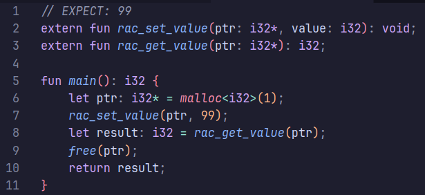
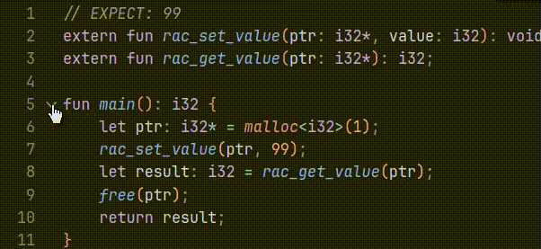

# Raccoon Language README

Syntax highlighting and language support for the [Raccoon programming language](https://github.com/FloofyPlasma/raccoon).

## Features

#### Syntax Highlighting

#### Auto-closing brackets

#### Code folding
  

## Extension Settings

Include if your extension adds any VS Code settings through the `contributes.configuration` extension point.

For example:

This extension contributes the following settings:

* `myExtension.enable`: Enable/disable this extension.
* `myExtension.thing`: Set to `blah` to do something.

<!--## Known Issues -->

## Release Notes

### 1.0.0

Initial release of Raccoon VScode

---
